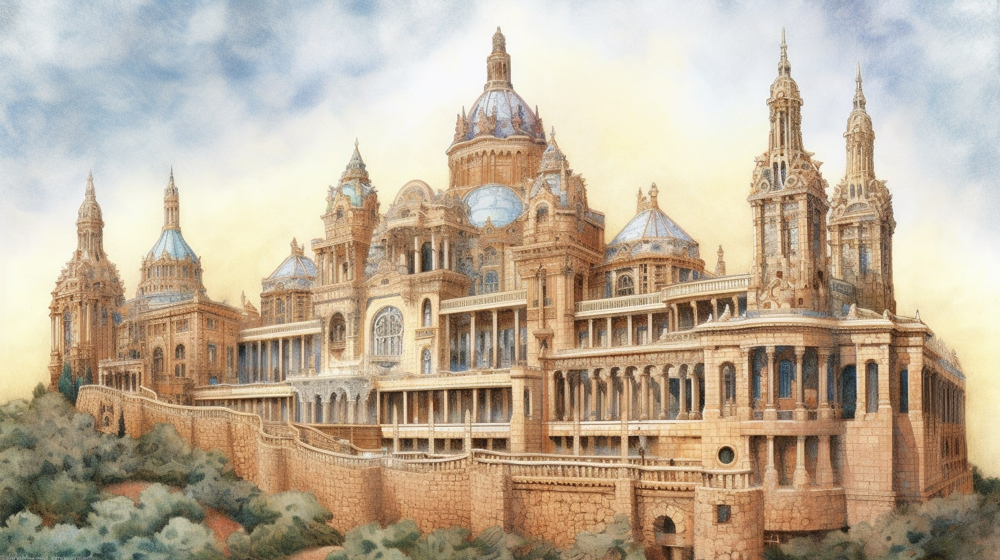

# Travel City Guide: Barcelona

Barcelona is a vibrant city on the Mediterranean coast of Spain. With its rich history, stunning architecture, and delicious cuisine, it's no wonder that Barcelona is a popular travel destination. In this 3-day travel guide, we'll explore some of the city's top attractions and hidden gems.

## Itinerary

### Day 1

On your first day in Barcelona, start your morning with a visit to the iconic Sagrada Familia. This breathtaking basilica was designed by the famous architect Antoni Gaudí and is a must-see for any visitor to Barcelona. Be sure to book your tickets in advance, as this is a popular attraction.

After exploring the Sagrada Familia, head to the nearby Park Güell, another one of Gaudí's masterpieces. This whimsical park is full of colorful mosaics, sculptures, and stunning views of the city.

Finish your day with a stroll down La Rambla, Barcelona's most famous street. Here you'll find street performers, shops, and restaurants. Be sure to stop by La Boqueria, a bustling market where you can sample some of Barcelona's delicious food.

### Day 2

Start your second day in Barcelona with a visit to the Gothic Quarter. This historic neighborhood is full of narrow streets, beautiful architecture, and charming cafes. Be sure to visit the Barcelona Cathedral, a stunning Gothic church.

After exploring the Gothic Quarter, head to the beach for some sun and sand. Barceloneta Beach is a popular spot for tourists and locals alike, with its lively atmosphere and beautiful views.

Finish your day with a visit to the Picasso Museum, where you can see some of the famous artist's works. The museum is located in the Born neighborhood, which is also worth exploring for its trendy shops and cafes.

### Day 3

On your final day in Barcelona, start your morning with a visit to the stunning Palau de la Música Catalana. This concert hall was also designed by Gaudí and features beautiful stained glass windows and intricate mosaics.

After visiting the Palau de la Música Catalana, head to the Eixample neighborhood for some shopping. This upscale area is home to designer boutiques and high-end shops.

Finish your day with a visit to the Montjuïc Castle, located on a hill overlooking the city. The castle has a rich history and offers stunning views of Barcelona.

## Visited Places

Here is a list of all the visited places during your trip to Barcelona:

- Day 1
    - Sagrada Familia
    - Park Güell
    - La Rambla
    - La Boqueria
- Day 2
    - Gothic Quarter
    - Barcelona Cathedral
    - Barceloneta Beach
    - Picasso Museum
- Day 3
    - Palau de la Música Catalana
    - Eixample neighborhood
    - Montjuïc Castle

## Fun Facts

- Barcelona is the capital of the Catalonia region of Spain.
- The city is home to several UNESCO World Heritage Sites, including the Park Güell and the Palau de la Música Catalana.
- The construction of the Sagrada Familia began in 1882 and is still ongoing.
- The Gothic Quarter is the oldest neighborhood in Barcelona and contains many buildings dating back to medieval times.
- Barcelona is known for its delicious cuisine, including dishes such as paella, tapas, and churros.
- The Montjuïc Castle was originally built in 1640 and has served as a military fortress, prison, and military museum over the years.

Barcelona is a beautiful and vibrant city with so much to offer visitors. Whether you're interested in history, architecture, or just soaking up the local culture, Barcelona is sure to impress. With this 3-day travel guide, you'll be able to experience some of the best that the city has to offer.